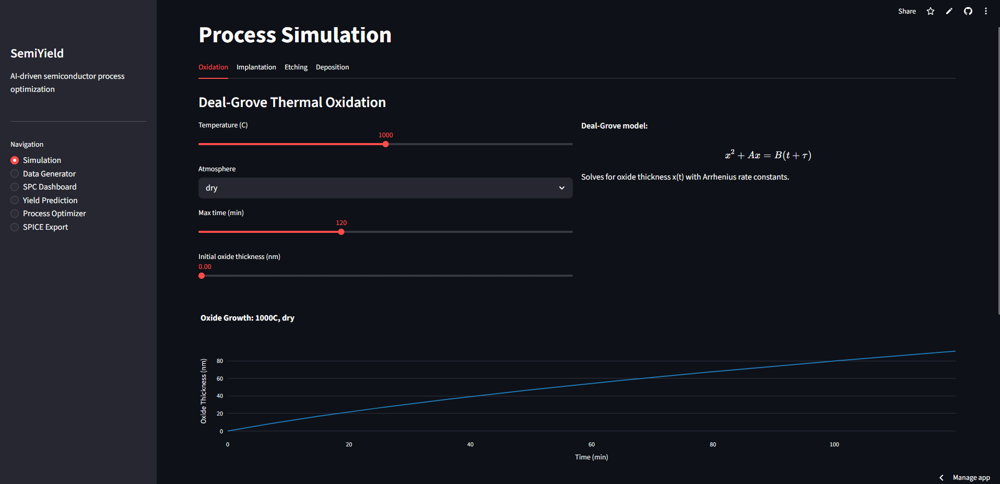
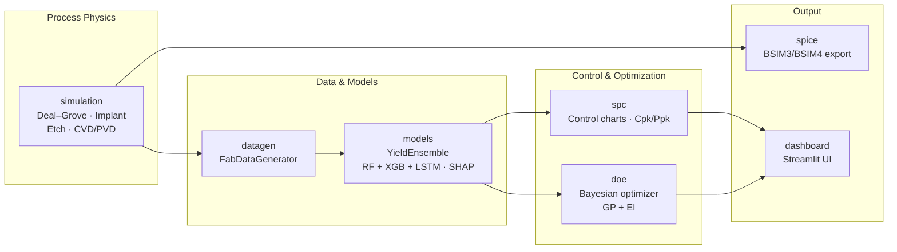

<div align="center">

# SemiYield

**AI-driven semiconductor process optimization and yield prediction**

[](https://github.com/OutBlade/semiyield/actions)
[](https://www.python.org/)
[](LICENSE)
[](https://github.com/psf/black)
[](https://semiyield.streamlit.app)

First-principles process simulation · ML yield prediction · SPC · Bayesian DOE · SPICE export

[**Live Demo**](https://semiyield.streamlit.app) · [Quick Start](#quick-start) · [Architecture](#architecture) · [Module Reference](#module-reference) · [Contributing](#contributing)

<br/>

[](https://semiyield.streamlit.app)

</div>

---

## Overview

**SemiYield** is an open-source Python platform that unifies the semiconductor process-integration workflow — from physics-based process simulation through machine-learning yield prediction to SPICE model handoff — in a single, consistently-designed toolkit.

It is built for **process engineers**, **device researchers**, and **students** working on silicon fabrication who today juggle separate tools for simulation, statistics, and circuit modeling.

> **Try it now:** the full dashboard is hosted 24/7 at [semiyield.streamlit.app](https://semiyield.streamlit.app) — no installation required.

## Key Capabilities

| Capability | What it does | Module |
| :--- | :--- | :--- |
| **Process simulation** | Deal–Grove oxidation, ion implantation (Gaussian / Pearson IV), Langmuir–Hinshelwood plasma etch, CVD/PVD deposition | `semiyield.simulation` |
| **Synthetic fab data** | Lot- and wafer-level data with realistic drift, equipment aging, spatial non-uniformity, and Murphy's yield model | `semiyield.datagen` |
| **Yield prediction** | Stacked RF + XGBoost + LSTM ensemble with uncertainty estimates and SHAP explainability | `semiyield.models` |
| **Statistical process control** | Xbar-R/S, I-MR, EWMA, CUSUM charts; all 8 Western Electric rules; Cp/Cpk/Pp/Ppk capability | `semiyield.spc` |
| **Bayesian DOE** | Gaussian-process surrogate with Expected Improvement for sample-efficient process-window optimization | `semiyield.doe` |
| **SPICE export** | Physical parameters → BSIM3v3/BSIM4 model cards compatible with ngspice and LTspice | `semiyield.spice` |
| **Interactive dashboard** | Streamlit web UI tying all modules together | `dashboard` |

## Architecture

The six modules mirror the natural flow of a process-integration workflow:



## Installation

**Requirements:** Python 3.10+

### From source (recommended)

```bash
git clone https://github.com/OutBlade/semiyield.git
cd semiyield
pip install -e ".[dev]"
```

### Docker

```bash
docker compose up
```

The dashboard will be available at <http://localhost:8501>.

### Windows one-liner

```bat
start.bat
```

## Quick Start

### Process simulation

```python
from semiyield.simulation import DealGroveModel, IonImplantationModel
import numpy as np

# Thermal oxidation: 1 hour dry O2 at 1000 °C
model = DealGroveModel()
thickness_nm = model.grow(time=60, temperature=1000, atmosphere="dry")
print(f"Oxide thickness: {thickness_nm:.1f} nm")

# Boron implantation profile
impl = IonImplantationModel(distribution="gaussian")
depths = np.linspace(0, 400, 500)  # nm
conc = impl.profile(depths, dose=1e13, energy=80, species="boron")
xj = impl.junction_depth(dose=1e13, energy=80, species="boron", background=1e16)
print(f"Junction depth: {xj:.1f} nm")
```

### Yield prediction with uncertainty

```python
from semiyield.datagen import FabDataGenerator
from semiyield.models import YieldEnsemble, SHAPExplainer

# Generate synthetic fab data
gen = FabDataGenerator(seed=42, drift_rate=0.05, aging_factor=0.002)
df = gen.generate(n_lots=100, wafers_per_lot=25)

feature_cols = ["gate_oxide_thickness", "poly_cd", "implant_dose",
                "anneal_temp", "metal_resistance", "contact_resistance"]
X, y = df[feature_cols].values, df["yield"].values

# Train the RF + XGBoost + LSTM ensemble
model = YieldEnsemble(n_estimators=200, lstm_epochs=50)
model.fit(X[:800], y[:800], X[800:900], y[800:900])

# Predict with uncertainty estimates
mean, std = model.predict_proba(X[900:])
print(model.score(X[900:], y[900:]))  # {'R2': ..., 'RMSE': ...}

# SHAP feature importance
explainer = SHAPExplainer()
top = explainer.top_features(model.rf, X[900:], feature_cols, n=5)
```

<details>
<summary><b>Statistical process control</b></summary>

```python
from semiyield.spc import ControlChart, western_electric_violations, process_capability

# Fit an I-MR chart on historical data
chart = ControlChart(chart_type="IMR")
chart.fit(df["gate_oxide_thickness"].values)

# Check a new measurement
in_control = chart.update(8.4)  # True or False

# Detect Western Electric rule violations
data = df["poly_cd"].values
cd = chart.chart_data()
violations = western_electric_violations(data, cd["ucl"], cd["lcl"], cd["cl"])
for idx, rule, desc in violations:
    print(f"Violation at index {idx}: {desc}")

# Process capability
cap = process_capability(data, usl=100.0, lsl=80.0)
print(f"Cpk={cap['Cpk']:.3f}, Ppk={cap['Ppk']:.3f}")
```

</details>

<details>
<summary><b>Bayesian process-window optimization</b></summary>

```python
from semiyield.doe import ProcessWindowOptimizer

optimizer = ProcessWindowOptimizer(seed=0)
optimizer.define_space({
    "gate_oxide_time": (50, 200),    # seconds
    "anneal_temp": (900, 1100),      # °C
})

def my_yield_fn(x):
    # Replace with a real measurement or model prediction
    return float(some_yield_model.predict(x.reshape(1, -1))[0])

result = optimizer.optimize(my_yield_fn, n_iter=50)
print("Best params:", result["best_params"])
print("Best yield:", result["best_value"])

window = optimizer.process_window(confidence=0.95)
for param, (lo, hi) in window.items():
    print(f"  {param}: [{lo:.1f}, {hi:.1f}]")
```

</details>

<details>
<summary><b>SPICE model export</b></summary>

```python
from semiyield.spice import SPICEExporter

exporter = SPICEExporter(model_level="bsim3")
process = {
    "oxide_thickness_nm": 8.5,
    "channel_length_nm": 90.0,
    "doping_concentration": 1e17,
    "junction_depth_nm": 50.0,
}

params = exporter.process_to_spice(process, "nmos_90nm")
print(f"VTH0 = {params['VTH0']:.4f} V")
print(f"U0   = {params['U0']:.1f} cm2/Vs")

exporter.write_model_card(process, "nmos_90nm", "nmos_90nm.lib")
exporter.write_testbench("nmos_90nm", "testbench.sp")
```

</details>

## Dashboard

Run the Streamlit dashboard locally:

```bash
streamlit run dashboard/app.py
```

Or with Docker:

```bash
docker compose up
```

Then open <http://localhost:8501> — or skip setup entirely with the hosted demo at [semiyield.streamlit.app](https://semiyield.streamlit.app).

## Module Reference

### `semiyield.simulation` — first-principles process models

- **`DealGroveModel`** — Deal–Grove linear-parabolic oxidation with Arrhenius rate constants for dry O₂ and steam ambients.
- **`IonImplantationModel`** — dopant profiles via Gaussian and Pearson IV distributions with LSS-theory range parameters for B, P, As, and Sb in silicon.
- **`LangmuirHinshelwoodModel`** — plasma etch rates from surface adsorption kinetics, in single-reactant (CF₄) and two-reactant competitive (CHF₃/O₂) modes.
- **`CVDModel`** — LPCVD, PECVD, ALD, and PVD deposition: growth rate, step coverage, non-uniformity, and biaxial film stress.

### `semiyield.datagen` — synthetic fab data

- **`FabDataGenerator`** — lot- and wafer-level process data with lot-to-lot drift (random walk), equipment aging, wafer spatial non-uniformity, and Murphy's yield model.

### `semiyield.models` — machine learning

- **`YieldEnsemble`** — stacks RandomForest, XGBoost, and an LSTM with Ridge-learned ensemble weights; uncertainty via RF variance and Monte-Carlo dropout.
- **`SHAPExplainer`** — feature-importance ranking and process sensitivity analysis via SHAP Tree/Kernel explainers.

### `semiyield.spc` — statistical process control

- **`ControlChart`** — Xbar-R, Xbar-S, I-MR, EWMA, and CUSUM charts with Phase I limit estimation and real-time Phase II updating.
- **`western_electric_violations`** — all eight Western Electric Handbook run-pattern rules.
- **`process_capability`** — Cp, Cpk, Pp, Ppk, and sigma level per the AIAG SPC Manual.

### `semiyield.doe` — design of experiments

- **`ProcessWindowOptimizer`** — BoTorch `SingleTaskGP` surrogate with Expected Improvement acquisition; falls back to scipy when BoTorch is unavailable.

### `semiyield.spice` — circuit model handoff

- **`SPICEExporter`** — converts physical process parameters to BSIM3v3/BSIM4 model cards (depletion-approximation V<sub>TH</sub>, Caughey–Thomas mobility, short-channel parameters) compatible with ngspice and LTspice.

## Scientific Background

<details>
<summary><b>Deal–Grove oxidation model</b></summary>

The Deal–Grove model (1965) describes thermal SiO₂ growth via a linear-parabolic equation derived from Fick's law of diffusion through the growing oxide combined with a surface reaction. The parabolic term dominates at large thickness (diffusion-limited); the linear term at early times (reaction-limited). Rate constants B and B/A follow Arrhenius temperature dependence, and wet (steam) oxidation proceeds roughly 5–10× faster than dry oxidation due to the higher solubility and diffusivity of water in SiO₂.

</details>

<details>
<summary><b>Langmuir–Hinshelwood etch kinetics</b></summary>

The Langmuir–Hinshelwood mechanism models surface reactions where reactant species first adsorb onto surface sites before reacting; fractional coverage follows θ = KP/(1+KP). In plasma etching, the two-reactant competitive form captures the interplay between fluorocarbon polymer deposition (CHF₃) and polymer removal (O₂), which determines oxide-to-silicon selectivity.

</details>

<details>
<summary><b>Murphy's yield model</b></summary>

Murphy's yield model (1964) gives IC yield as a function of die area and random defect density. Assuming a triangular distribution of defect densities across wafers, integration yields Y = ((1−e<sup>−AD</sup>)/(AD))². Yield falls rapidly for large die or high defect density — motivating both defect reduction and die-size minimization.

</details>

<details>
<summary><b>Bayesian optimization</b></summary>

Bayesian optimization replaces exhaustive DOE grids with a cheap-to-evaluate probabilistic surrogate (Gaussian process). Each iteration, an Expected Improvement acquisition function balances exploration of uncertain regions against exploitation of known-good regions — finding process optima in far fewer experiments than grid or random search. This matters when every wafer run is expensive.

</details>

## Project Structure

```
semiyield/
├── .github/              # CI workflows
├── .streamlit/           # Streamlit configuration
├── dashboard/            # Streamlit web UI
├── docs/                 # Documentation and images
├── semiyield/            # Core library
│   ├── simulation/       #   Process physics models
│   ├── datagen/          #   Synthetic fab data generation
│   ├── models/           #   ML yield prediction
│   ├── spc/              #   Statistical process control
│   ├── doe/              #   Bayesian optimization
│   └── spice/            #   SPICE model export
├── tests/                # Test suite
├── Dockerfile
├── docker-compose.yml
└── pyproject.toml
```

## Development

Run the test suite:

```bash
pytest
```

With coverage:

```bash
pytest --cov=semiyield --cov-report=html
```

Lint and format before committing:

```bash
ruff check .
black .
```

Code style: **black** (line length 100) and **ruff**. All physics formulas should include inline citations.

## Contributing

Contributions are welcome!

1. **Open an issue** to discuss the proposed change.
2. **Fork** the repository and create a feature branch.
3. **Write tests** for any new functionality.
4. **Open a pull request** — CI must pass before review.

## License

This project is licensed under the MIT License — see the [LICENSE](LICENSE) file for details.

---

<div align="center">

Built for process engineers, researchers, and students working on silicon device fabrication.

**[semiyield.streamlit.app](https://semiyield.streamlit.app)**

</div>
